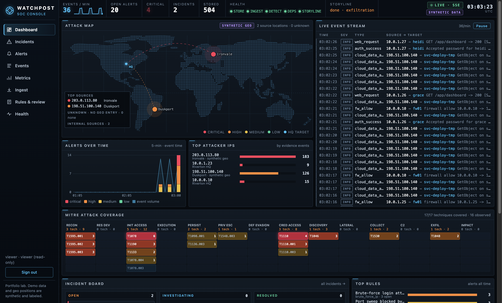
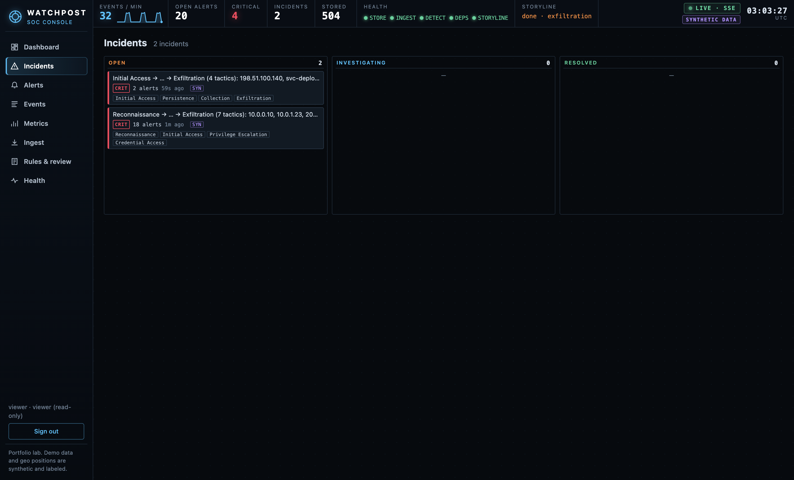
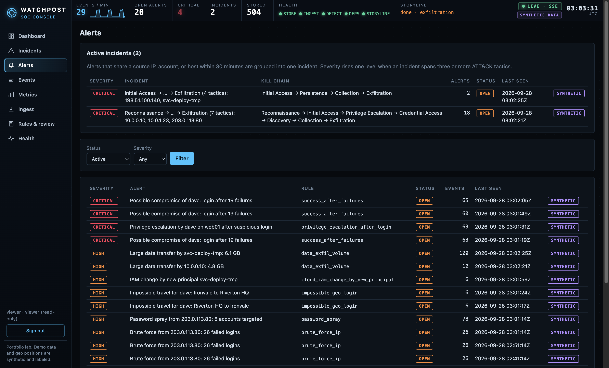

# Watchpost: a small, working SIEM

Watchpost is a self-contained Security Information and Event Management (SIEM) lab. It ingests authentication, web, firewall/VPN, cloud audit, and host logs, normalizes them into one schema, and stores them in SQLite. It runs explainable detection rules, raises alerts with evidence, and supports an analyst workflow from triage to resolution. It also reports its own health and learns nothing on its own: rule changes come from analyst feedback and need approval from a second person.

It uses only the Python standard library (3.10+). No packages to install, no paid services, no outbound network calls.

> **Honesty note.** This is a portfolio/learning project, not a production SIEM. All bundled data is synthetic. See [What is real vs. synthetic vs. future](#what-is-real-vs-synthetic-vs-future).

**Live demo:** https://watchpost-nxxu.onrender.com (read-only login `viewer` / `watchpost-viewer-demo`; free tier, first load may take a minute).



| Incident board | Alerts and correlated incidents |
|---|---|
|  |  |

<!-- Still to capture for 2.0 (1280x800, save under docs/screenshots/):
     incident-detail.png (kill-chain stages, techniques by tactic), incident-report-pdf.png (first page of the PDF),
     storyline-running.png (dashboard mid-storyline with the stage tile). -->

## What's new in 4.0

4.0 is about making each claim checkable: every feature has a test, every number comes from a script you can rerun, and the limits are written down next to the feature.

| Change | What it adds |
|---|---|
| **Tamper-evident audit log** | Audit entries form a hash chain (HMAC-SHA256 with `SIEM_AUDIT_KEY`, plain SHA-256 without). `GET /api/audit/verify` (admin) walks it and reports `verified`, `partial`, or `broken` with the first break; **Admin → Audit log** shows a badge. What it does and does not detect is listed under [Tamper-evident audit log](#tamper-evident-audit-log). |
| **ATT&CK coverage graded by evidence** | Each technique is **validated** (an enabled rule detects a labeled scenario that shows it), **mapped**, **disabled**, or a **gap**. With the default rules, 16 of 19 catalog techniques are validated and 3 are only mapped. Validated means detected on the project's own synthetic scenarios, not in real traffic. See [ATT&CK coverage](#attck-coverage). |
| **Hunting** | A one-line query language over events (`field:value`, prefixes, `NOT`, `last:7d`, `since:`/`until:`), compiled from a field whitelist with bound values. Saved searches for analysts and admins; the viewer can run them. See [Hunting](#hunting). |
| **Two new detections** | `cloud_logging_disabled` (T1562.008) and `admin_action_from_new_source` (T1078), fourteen rules in total. Each has a labeled attack and a benign look-alike in the noise lab, and the cold-start limits are documented. |
| **Load test and indexes** | `scripts/loadtest.py` (seeded, stdlib only) ingests 100,000 synthetic events and times the read routes. New indexes and narrower per-batch history reads; one laptop run ingested 5,314 events/s. See [Performance](#performance). |
| **Reviewed asset edits** | Builds on Juan Carlos Munera's asset inventory (PR #9): an edit that could lower alert severity (lower criticality, drop a tag or address, rename, delete, claim another asset's address) needs a second admin, with before/after evidence and the alerts it would move. An address listed on several assets now matches all of them, so inventory order never decides the weighting. See [Asset inventory review](#asset-inventory-review). |
| **Keyboard triage and accessibility** | `j`/`k`/`Enter`/`a`/`r`/`Esc`/`/`/`?` shortcuts, landmarks and labels, native dialogs, AA contrast, and a 390px layout, checked by static tests and a headless browser script (automated checks only, not a screen-reader audit). See [Keyboard shortcuts](#keyboard-shortcuts). |

## What's new in 3.1

A small follow-up round. Nothing here changes how the rules detect.

| Change | What it adds |
|---|---|
| **Revoke a tuning exception** | An admin can end an approved exception before it expires (`POST /api/suppressions/<id>/revoke`, admin only, audited as `suppression_revoked`). It stops applying from the next detection run, for both the skip behaviour and the exfil baseline mode. The row stays in the list as history with who revoked it and when. |
| **Review evidence matches the action** | Every change request carries an `evidence_digest` (SHA-256 of its stored evidence). An approval must send the digest of the evidence the reviewer was shown; the server recomputes the evidence and applies the change only when the digests match, all in one transaction. On a mismatch nothing is applied: the request stays pending with the fresh evidence and the API answers 409, and a retry or a second reviewer has to send the new digest. Exception evidence gains a **live impact** section: existing alerts for that rule and group key by status and verdict, the newest few, whether any labeled scenario contains the key at all, how many were ever closed as a true positive, and the status changes the proposer made on them. For `data_exfil_volume` it states that the exception enables baseline mode instead of hiding findings. Two gates protect labeled detections, and they differ on purpose. An **exception** is refused outright, at propose and at approve, when it would make the rule miss a labeled attack it detects today, or when a matching alert has ever been closed as a true positive (read from the append-only alert history, so re-closing the alert as benign does not lift it). A value that a rule change adds to an ignore list (`ignore_ips`, `ignore_users`, `sanctioned_services`), or removes from `privileged_users`, is a permanent exception with no expiry, so each such edit gets the same live impact in the evidence and the same refusal on true-positive history. The gate decides which alerts an entry touches with the same function the rules use to apply it (`rules.covers`), so the two cannot read an entry differently. A **rule change** that loses a labeled detection (a looser threshold, or disabling the rule) can be a legitimate trade, so it is not refused: the reviewer must send `acknowledge_detection_loss: true`, the UI asks for it with a required checkbox, and the audit entry names the scenarios. |
| **Inventory refresh** | In Admin, the asset inventory card redraws after "Load synthetic demo data", without a page reload. |
| **ATT&CK Navigator export** | `GET /api/attack/navigator.json` (viewer) returns the rule coverage as a MITRE ATT&CK Navigator layer: one entry per catalog technique, colored by its evidence level (validated, mapped, disabled, gap; see ATT&CK coverage below), scored by alert count, with the level and the mapped rules in the comment. The scores come from synthetic demo data and the layer says so. It names no ATT&CK release because the static technique table does not state one. The dashboard coverage panel links to it. |

## What's new in 3.0

3.0 came out of the feedback on the 2.0 post. Each item answers something a reader asked for.

| Feature | Asked by | What it adds |
|---|---|---|
| **Noise lab** | Charles Vosburgh, Issouf D. Dayo | Benign look-alike scenarios for the rules (an authorized scanner, an on-call admin at 03:00, an office NAT after a password-expiry day, a nightly backup, and more). `GET /api/noise-lab` and the **Noise lab** view show, per rule, recall, precision, the look-alikes it was tested against, and the ones that fired. Rules that are noisy are shown as noisy: with default settings in 3.0, 8 of the 12 rules fired on at least one benign scenario (in 4.0 it is 8 of 14; the two new rules stay quiet on their look-alikes). |
| **Baseline-aware exfiltration** | Abderrazak Benarous | `data_exfil_volume` keeps its flat thresholds by default: history and analyst verdicts never quiet it. A principal with an approved, unexpired tuning exception (analyst proposes, admin approves) is not skipped but compared with its own history (`baseline_multiplier`, 7-day window), so an excepted nightly backup that always moves several GB stays quiet and still alerts at 3x its own normal. The alert states which mode applied and, in baseline mode, the baseline and the ratio. |
| **Tuning exceptions** | Issouf D. Dayo | A reviewed, expiring allowlist (rule + group key + reason, 1 to 90 days). An analyst proposes one, an admin approves it through the existing two-person review, and the engine skips matching findings and counts them as suppressed. In 3.0 exceptions ended only by expiring; 3.1 added a revoke route. |
| **Shadow IT rule** | Issouf D. Dayo | A twelfth rule, `unsanctioned_cloud_service`, flags use of a cloud service that is not on the rule's sanctioned list (mapped to T1567). It is not part of the attack storyline. |
| **Entity risk** | (added) | Every user, source IP, and host gets a risk score: each alert adds a severity weight (critical 40, high 20, medium 10, low 5, info 1) that halves every 24 hours, and alerts closed as false positive or benign add nothing. `GET /api/entities` and an entity page list the contributing alerts and their weights, so the score can be checked by hand. Asset criticality counts through severity: an alert on a critical or sensitive asset is raised before it is stored, and the breakdown shows the rule's base severity and the asset note next to the raised one. No ML; every point traces to an alert. The dashboard has a **Riskiest entities** panel. |
| **SOC metrics** | (added) | Time to resolve by severity, false-positive rate by rule, and open-alert aging. Time to detect and dwell time are deliberately left out: the demo replays synthetic events with old timestamps, which would make both numbers meaningless. |

Left for a contributor's pull requests ([issue #8](https://github.com/talalkashar/watchpost/issues/8)): encrypted syslog, more log sources, orchestration, hot/warm/cold retention, stronger correlation, and threat intelligence.

## What's new in 2.0

| Workstream | What it adds |
|---|---|
| **A · Correlation and MITRE ATT&CK** | Parsers for nginx/Apache access logs, firewall/VPN, CloudTrail-style cloud audit, and host sudo/process events. Six new rules (eleven in total), each mapped to techniques from a static 17-technique ATT&CK subset. Alerts that share an IP, account, or host are correlated into **incidents** with kill-chain stages, and severity is escalated at 3+ tactics. Adds `GET /api/attack/coverage`. |
| **B · SOC dashboard** | A dark command-center view with a status strip, an attacker map (inline SVG, **synthetic geo** only), a live event stream over **Server-Sent Events** (`/api/stream`, with a polling fallback), alerts over time, top attacker IPs, an ATT&CK heat matrix, an incident board, and health. No JS libraries. |
| **D · Incident reports** | One-click **Markdown and PDF** reports for incidents and alerts, with a timeline, entities, techniques by tactic, evidence, notes, and recommended actions per technique. The PDF writer is hand-written PDF 1.4. |
| **E · Live ingestion** | A UDP/TCP **syslog listener** (RFC 3164/5424) and `scripts/shipper.py`, a file tailer that posts to the ingest API with a token. See [docs/LIVE_INGEST.md](docs/LIVE_INGEST.md). |
| **F · Demo kit** | A read-only **viewer** role that the server enforces on every route, with a public demo account from `SIEM_VIEWER_PASSWORD`. **Per-IP rate limiting** (strict on login). A **`deploy/`** kit for Debian 12: a hardened systemd unit, an idempotent installer, and Caddy or nginx HTTPS. A LinkedIn kit and demo script. |
| **G · Asset modeling** | An **asset inventory** (Admin → Asset inventory) gives hosts a weight of importance (`low` to `critical`) and tags the systems that process **sensitive data** (`pii`, `pci`, `phi`, `credentials`, `financial`, `confidential`). Alerts whose evidence touches a high or critical asset, or a sensitive-data system, are raised one or two severity levels, with the rule's own severity and the reason kept on the alert; incidents and reports inherit the weighting. Changing the inventory re-weighs open alerts at once. Adds `GET/POST /api/assets`. Built by Juan Carlos Munera (PR #9); edits that could lower severity now go through two-person review (see [Asset inventory review](#asset-inventory-review)). |
| **C · Attack storyline** | **Admin → Start storyline** replays a six-stage synthetic intrusion in real time (recon → credential attack → foothold → escalation → lateral and cloud → exfiltration) over baseline noise; the dashboard shows the current stage. `SIEM_DEMO_LOOP=<minutes>` replays it on a timer for unattended public demos. |

### 2.0 architecture

```
  SOURCES                         INGEST (auth: session+CSRF or ingest token)        STORE / ANALYZE
  ───────                         ───────────────────────────────────────────        ───────────────
  log files ──────────────┐
  shipper.py (E) ─────────┤  POST /api/ingest[/upload] ─┐
  simulator / storyline(C)┤                             ├─► normalize.py ──► events (SQLite, synthetic flag)
  syslog UDP/TCP (E) ─► syslog_listener.py ─────────────┘   parse, validate,        │
                                                            redact secrets          ▼
                                                                         engine.run_detection
                                                                         rules.py: 11 pure rules (A)
                                                                         + attack.py ATT&CK map (A)
                                                                                    │
                                                                                    ▼
                                                                    alerts ──► correlate.py (A) ──► incidents
                                                                      │                               │
                                  ┌───────────── stream.py broker ◄───┴───────────────────────────────┤
                                  ▼                                                                   ▼
  BROWSER ◄── HTTPS ── Caddy / nginx (F) ── server.py on 127.0.0.1 ──────────────────► report.py + pdfwriter.py (D)
  dashboard.js, map.js,        deploy/         • ratelimit.py: per-IP buckets (F)       report.md / report.pdf
  charts.js (B), app.js        systemd unit    • roles viewer < analyst < admin (F)
  GET /api/stream (SSE, B)     (F)             • CSRF, CSP, sessions, ingest tokens
                                               • geo.py synthetic geo (B), health.py, improve.py
```

---

## Quick start

```bash
cd labs/siem
export SIEM_ADMIN_PASSWORD='choose-a-long-password'      # optional; otherwise generated
export SIEM_ANALYST_PASSWORD='choose-another-long-one'   # optional; otherwise generated
export SIEM_VIEWER_PASSWORD='a-read-only-demo-login'     # optional; creates a read-only `viewer` account
./start.sh                                               # http://127.0.0.1:8080
```

If you don't set the password variables, Watchpost generates random passwords on first start. It writes them to `data/initial_credentials.txt` (mode 0600) and never prints them to the logs.

Then sign in as `admin`, open **Admin → Load synthetic demo data**, and follow [DEMO_SCRIPT.md](DEMO_SCRIPT.md).

### Tests

```bash
./run_tests.sh      # 418 unit/integration tests + a 26-step end-to-end smoke check
```

### Replit

`.replit` is included. Before the first run, add `SIEM_ADMIN_PASSWORD` and `SIEM_ANALYST_PASSWORD` in **Secrets**. The Replit run command binds `0.0.0.0` (needed for the Replit webview) and sets `SIEM_SECURE_COOKIES=1`, because Replit serves over HTTPS. Anywhere else, the app binds to `127.0.0.1` unless you set `SIEM_HOST`. Keep the Repl private, or at least don't share the URL, unless you intend the app to be reachable.

### Configuration

| Variable | Default | Purpose |
|---|---|---|
| `SIEM_DB` | `data/watchpost.db` | SQLite database path |
| `SIEM_HOST` / `SIEM_PORT` (or `PORT`) | `127.0.0.1` / `8080` | Bind address |
| `SIEM_ADMIN_PASSWORD`, `SIEM_ANALYST_PASSWORD` | generated | Initial account passwords (min. 12 chars), used only when the database is empty |
| `SIEM_VIEWER_PASSWORD` | unset (no viewer) | Creates a read-only `viewer` account on start if none exists; never generated, never resets an existing viewer |
| `SIEM_SECURE_COOKIES` | `0` | Set `1` behind HTTPS |
| `SIEM_SESSION_TTL` | `28800` | Session lifetime in seconds |
| `SIEM_MAX_UPLOAD_BYTES` / `SIEM_MAX_BATCH_EVENTS` | 5 MB / 20000 | Ingestion limits |
| `SIEM_SYSLOG` | `0` | `1` also starts the UDP/TCP syslog listener ([docs/LIVE_INGEST.md](docs/LIVE_INGEST.md)) |
| `SIEM_SYSLOG_BIND` / `SIEM_SYSLOG_PORT` | `127.0.0.1` / `5514` | Syslog listener address (same port for UDP and TCP) |
| `SIEM_SYSLOG_ALLOW` | empty (any) | Comma-separated IPs/CIDRs allowed to send syslog |
| `SIEM_DEMO_LOOP` / `SIEM_DEMO_LOOP_SPEED` | `0` / `1` | Minutes between automatic replays of the synthetic attack storyline (0 = off) and its speed multiplier |
| `SIEM_RATE_LIMIT` | `1` | `0` turns off per-IP rate limiting |
| `SIEM_LOGIN_RATE_BURST` / `SIEM_LOGIN_RATE_PER_MIN` | `10` / `10` | Token bucket for `POST /api/auth/login`, per client IP |
| `SIEM_RATE_BURST` / `SIEM_RATE_PER_MIN` | `300` / `1200` | Token bucket for every other request (API and static), per client IP |
| `SIEM_TRUST_PROXY` | `0` | `1` behind a local reverse proxy: the client IP is the last `X-Forwarded-For` entry on loopback connections |
| `SIEM_AUDIT_KEY` | unset (unkeyed) | HMAC key for the audit log hash chain; see [Tamper-evident audit log](#tamper-evident-audit-log) |

### Public deployment

[`deploy/`](deploy/README.md) installs Watchpost on a Debian 12 VM as a hardened systemd service on loopback, with
Caddy (Let's Encrypt, for a domain) or nginx (self-signed, for a bare IP) in front:
`sudo ./deploy/install.sh --caddy demo.example.org`. Publish only the `viewer` login.

---

## Architecture

```
 log files ──► POST /api/ingest/upload ─┐
 shipper.py ─► (same, ingest token) ────┤
 collectors ─► POST /api/ingest (token) ├─► normalize.py ──► events (SQLite) ──► engine.run_detection
 simulator ──► (same API, loopback) ────┤   parse + validate      │                 │  rules.py (pure functions)
 syslog ─────► syslog_listener.py ──────┘   + redact secrets      │                 ▼
                                                                  │            alerts + alert_events
                                                                  ▼                 │
 browser UI (static/) ◄── server.py (auth, CSRF, roles) ◄── queries.py ◄────────────┘
                                   │
                                   ├── health.py   storage / ingestion / detection / dependencies
                                   └── improve.py  feedback → performance → suggestions → reviewed changes
                                                   + evaluation against labeled synthetic scenarios
```

| Module | Responsibility |
|---|---|
| `watchpost/normalize.py` | Parses JSON, JSONL, CSV, Linux `auth.log` (OpenSSH), and Windows Security events (4624/4625/4672/4688/4720/4740). Accepts common field aliases, including ECS-style nesting. Validates timestamps, IPs, severities, and lengths, strips control characters, and redacts secrets. Every rejected record gets a reason and a position. |
| `watchpost/correlate.py`, `watchpost/incidents.py` | Pure alert-to-incident grouping; incident queries, status changes, and ATT&CK coverage. |
| `watchpost/attack.py`, `watchpost/geo.py` | Static ATT&CK subset; synthetic geo table for demo IP ranges (never a real lookup). |
| `watchpost/rules.py` | Fourteen explainable rules as pure functions over event lists, each with a plain-English explanation. Also validates rule parameters. |
| `watchpost/engine.py` | Stores each batch atomically, then runs detection over the batch's time range plus the longest rule window. Rules that compare with earlier activity (`history_seconds`) also get their own history span before that, of only the event types they read. Deduplicates and extends open alerts, and records every detection run. |
| `watchpost/queries.py` | Event search (parameterized SQL), alert detail with evidence and a related-events timeline, notes, status changes, and SOC metrics. |
| `watchpost/hunt.py` | Hunt query parser and compiler (whitelisted fields, bound values) and saved searches. |
| `watchpost/auth.py` | PBKDF2-SHA256 password hashing, lockout, and server-side sessions (only token hashes are stored). Also ingest-only API tokens (hashed) and the viewer < analyst < admin roles. Viewers are read-only: the server refuses every non-GET request from them except logout. |
| `watchpost/totp.py` | RFC 6238 TOTP (HMAC-SHA1, 6 digits, 30 s, ±1 step), stdlib only. See [Two-factor sign-in and sessions](#two-factor-sign-in-and-sessions). |
| `watchpost/ratelimit.py` | In-memory per-IP token buckets. `server.py` answers 429 with `Retry-After` when a bucket is empty. |
| `watchpost/health.py` | Component checks, each with a status (`ok`/`degraded`/`failing`), a message, and recovery guidance. |
| `watchpost/improve.py` | Scenario evaluation (TP/FN/FP, recall, precision), rule performance from analyst verdicts, heuristic suggestions, and two-person change review. |
| `watchpost/backtest.py` | Replays a proposed rule change over stored events (kept / new / lost findings, open alerts it would lose) for the review evidence and the preview route. |
| `watchpost/syslog_listener.py` | Optional UDP/TCP syslog receiver (RFC 3164, RFC 5424, RFC 6587 framing). Runs each line through the auth.log parser, falls back to a generic `syslog` event with severity from PRI, and batches into the engine every 2 seconds. Reports itself as the `syslog` health component. |
| `scripts/shipper.py` | Stdlib-only file tailer for Linux boxes: batches new lines to `/api/ingest/upload` with an ingest token, with backoff, rotation handling, and a position file. |
| `watchpost/simulate.py` | Labeled synthetic scenarios and a CLI that sends only to loopback unless you explicitly allow otherwise. |
| `watchpost/report.py` | Incident and alert reports: one model (summary, timeline, entities, alerts with evidence, ATT&CK techniques by tactic, notes, recommended actions) rendered as Markdown or PDF. |
| `watchpost/pdfwriter.py` | Minimal hand-written PDF 1.4 writer (Helvetica, wrapping, tables, page breaks, xref). |
| `watchpost/server.py` | `http.server` routing, security headers (CSP, frame denial, nosniff), CSRF checks, body limits, and the static UI. |

### Normalized event schema

`id, ts (UTC ISO-8601), ingested_at, source, host, event_type, outcome, severity, user, src_ip, dest_ip, message, raw (redacted, truncated), synthetic, batch_id`

`event_type` is one of `auth_failure, auth_success, account_lockout, user_created, privilege_use, process_start, network_connection, file_access, other`, plus (2.0) `web_request, web_scan, web_error, fw_deny, fw_allow, vpn_login, cloud_api_call, cloud_iam_change, cloud_data_access, privilege_escalation`, and `syslog` (a line received by the syslog listener that no parser recognized). Events also carry `dest_port` and `bytes` when the source has them.

### Detection rules

| Rule | Fires when | Severity |
|---|---|---|
| `brute_force_ip` | ≥ 10 failed logins from one IP within 300 s | high |
| `password_spray` | one IP fails as ≥ 5 different accounts within 600 s | high |
| `account_repeated_failures` | one account has ≥ 8 failures within 900 s, from any IPs | medium |
| `success_after_failures` | a successful login follows ≥ 5 failures for that account within 600 s | critical |
| `off_hours_privileged_login` | `root`/`admin`/`administrator` logs in outside 08:00–18:00 UTC on weekdays, or at any time on weekends | medium |
| `web_scanner` | ≥ 5 scanner-like web requests (`/.env`, `/wp-login.php`, injection strings, scanner agents) from one IP within 300 s | medium |
| `firewall_port_sweep` | the firewall denies one IP on ≥ 10 distinct ports within 300 s | medium |
| `impossible_geo_login` | one account logs in from two places ≥ 500 km apart faster than 900 km/h (synthetic geo table only) | high |
| `privilege_escalation_after_login` | sudo/su/runas within 30 min of a login that followed ≥ 3 failures | critical |
| `cloud_iam_change_by_new_principal` | an IAM change by a cloud principal with no activity in the previous 24 h | high |
| `data_exfil_volume` | one account (or IP) moves ≥ 1 GB out, or makes ≥ 100 cloud data reads, within 1 h | high |
| `unsanctioned_cloud_service` | an account uses a cloud service that is not on the sanctioned list (or a subdomain of one) | medium |
| `cloud_logging_disabled` | a cloud audit event records `StopLogging`, `DeleteTrail` or `DeleteFlowLogs` (the `logging_actions` list) | high |
| `admin_action_from_new_source` | an account makes a privileged action (privilege use/escalation, cloud IAM change) from an IP it used for none of its privileged actions in the previous 7 days, and it made ≥ 3 in that span | medium |

Every rule maps to MITRE ATT&CK techniques from a small static catalog (`watchpost/attack.py`, 19 techniques, no network fetch). `GET /api/attack/coverage` grades each technique by evidence (below) and counts how often its rules fired.

The two newest rules use only fields the schema already carries, and each has a labeled attack and a benign look-alike in the noise lab (both detect their attack, tp 1 / fn 0 / fp 0, and stay quiet on their look-alike):

- **`cloud_logging_disabled`** (T1562.008). Reads the action from cloud audit messages of the form `<action> on <service>`, as the CloudTrail parser writes them. Attack `logging_disabled`: the rogue principal `svc-deploy-tmp` stops and deletes the trail, so in the demo it joins the cloud-intrusion incident as a Defense Evasion stage. Look-alike `trail_maintenance`: an admin creates a trail, changes event selectors, updates it and starts logging. `UpdateTrail` and `PutEventSelectors` are not listed by default because the event names the action but not the new settings, so the rule cannot tell whether such a change turned logging off. A denied `StopLogging` also alerts.
- **`admin_action_from_new_source`** (T1078, T1078.004). Attack `admin_new_source`: `ops-admin` changes IAM from the office each morning, then creates an access key from an outside address at 19:10. Look-alike `admin_known_source`: the same admin's IAM change from the usual address, plus a read-only call from a new one. **Cold start:** an account with fewer than `min_prior_actions` privileged actions in `history_seconds` has no baseline and never alerts. That covers every account on a fresh install until it has made three privileged actions, an account that admins less often than that in a week, and an account whose first privileged action is the attack (`cloud_iam_change_by_new_principal` covers a never-seen cloud principal). Events without a source IP, which includes most local sudo lines, are skipped. A legitimate admin on a new laptop address will alert.

MFA push fatigue (T1621) is not built: no event carries an MFA signal (the auth parsers record only success or failure, and the CloudTrail parser does not keep `MFAUsed`), and the rule would need a new log source.

### ATT&CK coverage

A rule mapping to a technique is a claim, not proof. The **Coverage** view (and `GET /api/attack/coverage`, viewer) puts every catalog technique on one of four levels:

| Level | Meaning |
|---|---|
| **validated** | An enabled rule maps to it and detects a labeled malicious scenario that exercises it. |
| **mapped** | An enabled rule maps to it, but no labeled scenario proves detection. Not counted as covered. |
| **disabled** | Only disabled rules map to it. |
| **gap** | No rule maps to it. |

Each malicious scenario in `watchpost/simulate.py` lists the techniques its events actually show (`SCENARIO_TECHNIQUES`), which is narrower than the rules' own mappings. With the default rules, 16 of 19 techniques are validated. T1595.001 (`firewall_port_sweep`: one outside source sweeping one host's ports is not scanning IP blocks), T1190 (`web_scanner`: the scan probes and sends injection strings but never exploits anything) and T1048 (`data_exfil_volume`: the scenario reads cloud storage but shows no exfiltration channel) are only mapped. Each technique lists its rules with their noise-lab verdict, the proving scenarios, and live alert counts; the Navigator layer is colored by the same levels.

The scenarios are synthetic, so "validated" means a rule detected the project's own labeled data, not that it would catch the technique in real traffic. The catalog holds only techniques a Watchpost rule maps to, so the counts are not a measure against all of ATT&CK.

### Incidents (correlation)

After each detection run, `watchpost/correlate.py` groups related alerts into incidents: alerts whose evidence shares a source IP, account, or host within 30 minutes. An incident needs two related alerts or one critical alert, lists its kill-chain stages (ATT&CK tactics in order), and is raised one severity level when it spans three or more tactics. Reruns change nothing; new alerts join an open incident.

Every rule accepts `ignore_ips` and `ignore_users`. The engine merges overlapping findings into one open alert instead of creating duplicates, and a rescan never re-alerts on evidence already attached to an alert.

### Self-diagnosis

`GET /api/health` is public and returns statuses only, with HTTP 503 when anything is failing. `GET /api/health/details` requires a login and adds details, recent redacted errors, and recent detection runs.

| Check | Failing / degraded when |
|---|---|
| storage | DB can't be opened, the integrity check fails, or the write probe fails (failing); < 100 MB free disk (degraded) |
| ingestion | server-side ingestion errors in 24 h, or > 25 % of records rejected (degraded) |
| detection | last run failed (failing); batches ingested while detection was failing and not yet reprocessed, no enabled rules, or a run stuck > 5 min (degraded) |
| dependencies | Python < 3.10, SQLite < 3.35, or DB directory not writable (failing); UI files missing (degraded) |
| syslog (only when `SIEM_SYSLOG=1`) | port can't be bound, invalid allow list, or a listener thread stopped (failing); last batch failed to store or frames dropped in the last 10 min (degraded) |

If detection fails, the events stay stored, the ingest response says `"detection": {"status": "failed", ...}`, and the UI shows a banner. A full **Run detection** processes the backlog and marks those batches `recovered`. Tests cover each of these paths.

### Continuous improvement (what it actually does)

1. When analysts resolve an alert, they record a verdict: `true_positive`, `false_positive`, or `benign`.
2. **Rules** shows per-rule alert counts and precision, TP / (TP + FP).
3. **Suggest improvements** applies fixed heuristics. If ≥ 2 false-positive alerts share an IP (or account) that never appears in a true positive, it proposes excluding that IP (or account). Otherwise, if false-positive event counts sit below every true-positive count, it proposes a higher threshold.
4. Each proposal, from the system or a person, is scored against the labeled synthetic scenarios before and after the change.
5. Nothing changes until an admin approves, and that admin can't be the one who proposed it. Approval bumps the rule version, writes `rule_history`, re-runs the evaluation, and records everything in the audit log. Security settings (lockout threshold and duration) follow the same process.

This is **not machine learning**. It is transparent, deterministic tuning support.

### Backtesting rule changes

Before a rule change is approved, `watchpost/backtest.py` replays the rule over stored events twice, once with today's params and once with the proposed ones, and compares the findings by group key: **kept**, **new** (fires only with the change) and **lost** (fires only today). Each finding lists its entities (linked to their entity pages), first and last time, event count, and a few evidence event ids. It loads events and applies active tuning exceptions and history context through the same engine functions detection uses (`engine.scan_events`, `engine.rule_findings`), so it reports what detection would really do with those params.

- **Window.** The last 7 days of stored event time, ending at the newest stored event. A preview can ask for 1 to 30 days. If the window holds more than 100,000 events, it starts later until it doesn't, and the result says `capped`. At least one rule window is always scanned. The result also gives the window, the number of events scanned, and how many of them are synthetic (`all`, `some` or `none`).
- **Open alerts.** A lost finding is marked when it reproduces an alert that is still open or under investigation. Reproducing means it shares evidence events with that alert under the same group key. The proposal would never have raised that alert. Approving such a change needs the same explicit `acknowledge_detection_loss: true` as losing a labeled attack, and the audit entry names the alerts (`acknowledged_open_alerts_lost`).
- **Review evidence.** Every `rule_update` proposal carries the backtest counts and up to 10 kept, new and lost findings in its evidence. The evidence is hashed into the `evidence_digest`, and approval must present the same digest. The digest covers the findings (kept, new, lost, and open alerts lost) but not the scan context (window, events scanned), so an unrelated event arriving between viewing and approving does not void the review; a change in what the proposal would keep, add, or lose does, and the reviewer has to look again.
- **Preview.** `GET /api/rules/<id>/backtest?params=<JSON>&days=<1-30>` backtests a draft without proposing it. The params are validated exactly as a `rule_update` proposal is (a bad value is a 400). The route needs the analyst role, like proposing. The viewer gets 403 but can read the backtest in a change request's evidence. Every backtest is rate-limited per account on top of the general request limit: previews get a burst of 6, then 12 a minute; rule proposals and approvals of rule changes, which also replay stored events, share a separate burst of 20, then 12 a minute. In the UI, **Propose change…** has a **Preview backtest** button, and **Rules & review** shows a "Backtest on stored events" block on each rule change.

What it is not: it replays stored events only, so it can't predict traffic you haven't stored or behavior that hasn't happened yet. A finding that is "kept" can still change size within its group key, and an open alert raised under older params, or from events outside the window, isn't counted. On the demo, the stored events are synthetic, and the block says so.

### Tamper-evident audit log

Each audit entry stores `prev_hash` and `hash`, where `hash = HMAC-SHA256(key, prev_hash + JSON of id, created_at, actor, action, target, detail)`. The previous hash is read and the new entry written in the same write transaction, so concurrent writers cannot fork the chain. `GET /api/audit/verify` (admin only) walks the log once and returns `{ok, status, entries, keyed, head: {id, hash}, chain_started: {id, created_at}, legacy: {entries, last_id}, first_break: {id, reason, detail} | null}`; **Admin → Audit log** shows the result as a badge.

`status` is `verified` only when every entry in the log is chained and intact, `partial` when the chain is intact but older unverified entries precede it, and `broken` when `first_break` is set. `ok` is `true` only for `verified`, so a script or monitor that checks `ok` never reads a partly unverified log as healthy.

**Where the chain starts.** The server only hashes entries it is writing. When no entry carries a hash (a new database, an upgrade from 3.x, or a log whose hashes were removed), the next start writes an `audit_chain_started` entry that links to a fixed genesis value (64 zeros) and records how many older entries exist, the last id, and an identifier of the key (an HMAC of a fixed label, not the key). Those older entries are **legacy**: they are counted, but nothing vouches for them. The result is `partial`, and the badge reads "Chain intact from entry #X (date), but N earlier entries are not verified". Upgrading a 3.x database therefore stays `partial` for good rather than the server signing whatever the file contains: those entries really are unverified.

**The key must stay the same.** The server refuses to start when `SIEM_AUDIT_KEY` differs from the key the chain was started with (including set versus unset), and it never appends an entry under another key. Verifying with another key reports `key_mismatch` instead of passing under plain SHA-256.

**What it detects:** an entry edited in place, one with its hash cleared, or one changed by a database trigger as it was written (`modified`; the server hashes the values it inserted, never the row read back); entries deleted from the middle or the start of the chain, an emptied log, or a chain start whose id shows earlier entries were removed (`deleted`); an entry rewritten together with its own hash, or a second chain start (`broken_link` at that entry or the one after it); legacy entries added or removed after the chain started (`legacy_mismatch`, checked against the signed count in the chain start).

**What it does not detect:**
- Deleting the newest entries. What remains is still a valid, shorter chain (the next append leaves an id gap, but nothing shows it before then).
- Why a chain restarted. Someone who can write the database file can drop the hash column, or clear every hash, and restart the server. The result is `partial` (not `ok`), with the old entries reported as unverified, but it looks the same as a genuine 3.x upgrade. A chain start dated after your upgrade is the sign.
- A full rewrite without a key. With `SIEM_AUDIT_KEY` unset the chain uses plain SHA-256 and `keyed` is `false`: anyone who can write the database file can recompute every hash, and verification passes. That mode only catches careless edits.
- Anyone who has the key. Set `SIEM_AUDIT_KEY` to a long random value kept outside the database (`python3 -c "import secrets; print(secrets.token_hex(32))"`). Set it before the first start and keep it (see above).

For the first two, record the head and the chain start (`id`, `hash`, `created_at`) somewhere the database cannot reach, such as a ticket, a log shipped off the box, or a daily note, and compare them later.

### Two-factor sign-in and sessions

Analysts and admins can add a TOTP second factor (RFC 6238: HMAC-SHA1, 6 digits, 30-second steps, codes from one step before or after accepted for clock drift). It is opt-in per account. The read-only `viewer` role cannot enroll (403), so the public demo login stays a single password step.

**Enrolling** (**Account → Two-factor sign-in**, or the API): `POST /api/auth/mfa/enroll` returns `{secret, otpauth_uri}` with `otpauth://totp/Watchpost:<user>?secret=...&issuer=Watchpost`. There is no QR code: enter the secret in your authenticator app. The secret stays pending, and sign-in stays one step, until `POST /api/auth/mfa/confirm` with `{"code"}` succeeds. `POST /api/auth/mfa/disable` with a current code turns it off (or cancels an unconfirmed setup). `GET /api/auth/mfa/status` (any role) returns `{enabled, pending, available}`.

**Signing in** with it on: `POST /api/auth/login` checks the password and answers `{"mfa_required": true, "mfa_token": ..., "expires_in": 300}` instead of a session. The token is server-side (only its hash is stored, in `mfa_pending`), lasts 5 minutes, and is consumed by the first successful `POST /api/auth/mfa` with `{mfa_token, code}`, which creates the real session. Both routes share the per-IP login rate limit.

- **Lockout.** A wrong code counts toward the same per-account lockout as a wrong password and is audited as `login_failed` with `{"reason": "mfa"}`. Each code attempt (at sign-in or when turning two-factor off) is counted before its code is checked, in one transaction with the lock check, so parallel guesses cannot get more than the threshold of codes checked per lockout window. A correct password does not reset the count for an enrolled account; only a correct code does, so knowing the password does not buy unlimited guesses. Locking drops the account's pending tokens.
- **Replay.** The last accepted time step is stored per account (`users.totp_last_step`); a code from that step or an earlier one is refused, including the code used to confirm enrollment.
- **Secrets.** The secret and codes are never logged or audited. **The secret is stored in the database as-is, not encrypted at rest**: anyone who can read the database file can generate codes. There is no key management here.
- **Recovery.** There are no recovery codes. If someone loses their authenticator, an admin resets it: `POST /api/users/<username>/mfa/reset` (admin, not for your own account), audited as `mfa_reset`, or **Admin → Sign-in sessions → Reset two-factor**. The user then signs in with the password alone until they enroll again.

**Sessions.** `GET /api/auth/sessions` lists your active sessions: `id` (a random, non-secret session id), `created_at`, `last_seen_at` (refreshed at most once a minute), `expires_at`, and `current`. The session token and its hash are never returned. IP address and user agent are not recorded. `POST /api/auth/sessions/<id>/revoke` ends one of your own sessions (analyst and up; someone else's id answers 404). Admins can list every session (`GET /api/sessions`, optional `?user=`) and revoke any (`POST /api/sessions/<id>/revoke`). Every revoke is audited as `session_revoked` with the owner as target. There is no password-change route yet, so nothing revokes sessions on a password change.

Schema 8 adds `users.totp_secret`, `totp_pending`, `totp_last_step`, `sessions.sid`, `sessions.last_seen_at`, and the `mfa_pending` table; sessions from before the upgrade get an id on the next start.

### Hunting

**Hunt** takes a one-line query over stored events. Terms are ANDed (there is no OR). The server echoes how it read each term, and the UI shows that as chips under the query box. The query lives in the URL (`#hunt/<query>`), so a hunt is a link you can share. Entity pages and the event detail have **Hunt** links that open it prefilled, for example `user:alice last:7d`.

| Form | Example | Meaning |
|---|---|---|
| `field:value` | `user:alice` | Exact match (user names ignore case, as in event search) |
| `field:prefix*` | `host:web*` | Starts with; unquoted values only |
| `field:"quoted"` | `user:"svc backup"` | Literal value; spaces and `*` are not special, `\"` escapes a quote |
| word or `"phrase"` | `"invalid password"` | Message contains (`%` and `_` are literal) |
| `NOT term` or `-term` | `NOT src_ip:10.0.0.5` | Excludes; events with no value in that field are kept |
| `last:` | `last:15m`, `last:24h`, `last:7d` | Window up to now, at most 365 days |
| `since:` / `until:` | `since:2026-10-01 until:2026-10-02T06:00Z` | ISO times, UTC unless an offset is given |

Fields: `user`, `host`, `source`, `outcome`, `src_ip`, `dest_ip`, `ip` (source or destination), `batch_id`, `event_type`, `severity`, `dest_port`, `synthetic` (`0`/`1`), `message`. An unknown field is an error that lists these. Queries are capped at 500 characters and 20 terms, and results page and sort like event search (newest first, up to 1000 per page).

```
user:alice event_type:auth_failure NOT src_ip:10.0.0.5 host:web* "invalid password" last:24h
ip:203.0.113.* event_type:fw_deny last:7d
event_type:auth_success -source:demo:* since:2026-10-01
```

Each term compiles to a fixed SQL fragment chosen from a field whitelist, with the value as a bound parameter, so a value like `user:"x' OR 1=1 --"` matches that literal user name and nothing else. Any role can run a hunt and read saved searches. Analysts and admins can save a search (the query is checked on save) and delete their own; admins can delete any. Each save and delete is written to the audit log.

### Asset inventory review

The asset inventory was contributed by Juan Carlos Munera (PR #9): criticality and sensitive-data tags per host, severity raised on alerts that touch them, and open alerts re-weighed whenever the inventory changes. Because the inventory raises severity, editing it can also lower severity, so one admin alone may not make an edit that could do that. Such an edit goes through the same two-person review as rule and setting changes.

| Needs a second admin | Applies at once (still audited) |
|---|---|
| Lowering criticality | Adding an asset |
| Removing a sensitive-data tag | Raising criticality |
| Removing an IP address (alerts on it stop matching) | Adding tags or addresses |
| Renaming the host (alerts on the old name stop matching; a change of case is not a rename) | Editing owner, kind, or description |
| Deleting the asset | |
| Claiming an address another asset already has | |

An address listed on several assets matches every one of them, so the order of the inventory (which a raise or a change of case can shift) never decides which asset an alert keeps. `assets.review_reasons` is the only definition of this list. The direct routes (`POST /api/assets`, `POST /api/assets/<id>`) apply an edit only when it has no review reasons, checked and written in one transaction. Otherwise they change nothing and answer 409 with `review_required`, the reasons, and `proposal_route`. `POST /api/assets/<id>/delete` always answers 409 that way. Proposals go to `POST /api/assets/<id>/proposals` (the full asset as for a direct edit, or `{"delete": true}`) or `POST /api/assets/proposals` (an add, if you want one reviewed), each with a `reason`. Proposing is admin only, like editing the inventory. Analysts and the viewer get 403, and the viewer can still read the inventory and its pending proposals.

An update stores only the fields it changes. The evidence a reviewer sees has the asset before and after, a before/after line for each changed field, the review reasons, and the open alerts whose severity the change would move, with from and to. Approval works like other change requests: a different admin (`POST /api/changes/<id>/review`), sending the `evidence_digest` they were shown. The server re-checks the change against the inventory as it is at that moment. If the asset was deleted, its new name is taken, or it already matches, the approval is refused with 409 and nothing is applied. If the asset was edited in between, the evidence is refreshed and the old digest is refused. An approved change is applied through the same asset functions as a direct edit, then open alerts are re-weighed and incident severities refreshed. Proposals, approvals, rejections, and the asset change itself are all written to the hash-chained audit log, and the asset entry names the change request. **Admin → Asset inventory** shows pending proposals on each asset (for example "Proposed: lower db01 to low (pending review, change #12)"), and the edit dialog offers **Propose for review** when the server answers 409. **Rules & review** lists them with the other change requests.

### Triage metrics

`GET /api/metrics/triage?window=7d` (any role, viewer included; `window` is `24h`, `7d`, `30d` (default), `90d`, or `all`) reports, per severity, for alerts created in the window: the count, how many are still `open` and unresolved, MTTA, MTTR, and SLA breaches. **Metrics overview** shows them in a table, and the alert list puts an `SLA: ack overdue` / `resolve overdue` badge on unresolved alerts past a target.

- **Acknowledged** (`alerts.acknowledged_at`, schema 7) is the first time an alert leaves `open`: *Start investigating*, or resolving straight from open. It is set once and never overwritten, even across reopens. Assigning an alert (`POST /api/alerts/<id>/assign` with `{"assignee": "<analyst or admin>"}`, analyst and up, audited) changes ownership only, not the status, so it does not count as an acknowledgement. Alerts that left `open` before schema 7 keep a NULL time; they are reported as `ack_unknown` and left out of MTTA and ack breaches rather than backfilled.
- **MTTA** is created → acknowledged; **MTTR** is created → resolved. Each comes as mean, median, and p90 (nearest-rank) in minutes over the alerts that have reached that step. All three timestamps are this instance's wall clock, so replayed event times do not distort them.
- **SLA breach**: the step took longer than its target, or is still pending and has been waiting longer. Late acknowledgements stay counted after the alert moves on; the list badge shows only what is overdue now.

| Severity | Acknowledge within | Resolve within |
|---|---|---|
| critical | 15 minutes | 4 hours |
| high | 1 hour | 24 hours |
| medium | 4 hours | 3 days |
| low, info | 24 hours | 7 days |

The targets are a constant (`watchpost/triage.py`, `SLA_TARGETS`), chosen as common SOC starting points, not taken from any contract. **On the demo every alert comes from synthetic scenarios**, so the numbers measure how quickly someone clicked through demo alerts, not a real team's performance. The response says so: `synthetic` is `none`, `some`, or `all`, with `synthetic_alerts`, and the panel carries the synthetic label.

---

## SOC dashboard

The landing view is a dark SOC console built for a 1280×800 screen: a status strip (events per minute, open and critical alerts, incidents, stored events, health checks, stream state, UTC clock), an attacker world map, a live event stream, alerts over time, top attacker IPs, the MITRE ATT&CK coverage heat matrix, an incident board, top rules, and health. Live updates arrive over Server-Sent Events (`GET /api/stream`); if the stream fails, the page polls every 3 seconds. Charts and the map are inline SVG drawn by `static/charts.js` and `static/map.js`, with no libraries and no external tiles.

**The map positions are synthetic.** `watchpost/geo.py` maps only the RFC 5737 documentation ranges to fictional city names at fixed coordinates, and the RFC 1918 ranges to internal sites. It is not a geo lookup. Any other address is listed as "unknown" and never guessed. The map is labeled "synthetic geo".

### Keyboard shortcuts

| Key | Where | Action |
| --- | --- | --- |
| `j` / `k` | Alerts list, Incidents board | Select the next / previous alert or incident (focus ring shows the selection) |
| `Enter` | Alerts list, Incidents board | Open the selected item |
| `a` | Alert or incident page | Start investigating (analyst and admin only) |
| `r` | Alert page | Open the resolve dialog (analyst and admin only) |
| `Esc` | Alert or incident page | Back to the list, with the item still selected; in a dialog, closes it |
| `/` | Any view | Focus the view's search box, or open Hunt when the view has none |
| `?` | Any view | Show the shortcut help (also the "Keyboard shortcuts" button in the side rail) |

Shortcuts never fire while you type in an input, textarea, or select, while a dialog is open, or with Ctrl, Alt, or Cmd held. The read-only viewer can move and open but gets no action keys.

### Accessibility and small screens

What was done: `nav` and `main` landmarks with a skip link, `aria-current` on the current view, a label or `aria-label` on every form control, clickable table rows reachable with Tab and opened with Enter, dialogs on the native `<dialog>` (focus stays inside, Esc closes, focus returns to the trigger), live regions for toasts and errors, status shown by shape and text as well as color, text alternatives on the charts, and no animation under `prefers-reduced-motion`. Text and badge colors meet WCAG AA (4.5:1) against every panel color of the one dark theme. Below 760px the nav folds behind a Menu button, controls are at least 40px tall, and wide tables scroll inside their card.

How it was checked: automated checks only, not a screen-reader audit. `tests/test_ui_a11y.py` asserts the cheap static parts (landmarks, labels in `index.html`, the shortcut handler ignoring typing and dialogs, color contrast computed from the CSS variables). `scripts/ui_check.js` drives headless Chromium through every view and the main dialogs at 1440px and 390px wide, as admin and as viewer: no horizontal page scroll, no unlabeled control or link (a small in-page audit, not axe), 40px tap targets at 390px, no JS errors, and the `j`/`k`/`Enter`/`a`/`r`/`Esc`/`/`/`?` flow. It needs `playwright-core` and a Chromium outside the repo:

```bash
NODE_PATH=/path/to/node_modules CHROME=/path/to/chrome-headless-shell node scripts/ui_check.js
```

## Attack storyline

Admin → "Attack storyline (synthetic)" replays a scripted six-stage intrusion over about two minutes (or faster): web scanning and a port sweep from `203.0.113.80`, a password spray then brute force against `dave`, a VPN login with the cracked password, sudo to root and a new `svc-deploy-tmp` account, a hop to `db01` and cloud IAM changes by that new principal, then bulk storage reads and large outbound transfers. Ten detection rules fire in order and correlation folds them into one Reconnaissance → Exfiltration incident while the dashboard updates live. Every record is labeled synthetic and uses RFC 5737 documentation addresses; the same replay runs in the test suite (`tests/test_storyline.py`) and the smoke check.

## Performance

One run on a dev laptop with synthetic data, not a benchmark. Your numbers will differ; the script is there so
you can produce your own.

```bash
python3 scripts/loadtest.py                    # 100,000 events into a throwaway DB under /tmp
python3 scripts/loadtest.py --events 250000 --json
```

`scripts/loadtest.py` (stdlib only, seed 7) generates a week of background activity (2,000 users, 200 hosts,
about 3,000 internal and 762 documentation-range IPs, 18 event types, a few very busy accounts) plus the labeled
demo scenarios, all stored as synthetic. It ingests them in time-ordered batches of 1,000 through the
`POST /api/ingest` handler (JSON parse, normalization, storage, and detection on each batch), runs one full
detection, then calls each read route's handler 20 times in-process and reports p50/p95. Read times include
the handler and JSON encoding, not HTTP. `--url http://127.0.0.1:8090 --token wp_... --db <that server's DB>`
ingests over HTTP instead.

Run on 2026-10-08 (UTC) with `python3 scripts/loadtest.py --json` (the same run as the command above, printed
as JSON). Machine: Python 3.14.2, macOS 26.6.2 arm64, 10 CPUs. Database on disk afterwards: 97.3 MB.

| Step | Result |
|---|---|
| Ingest (parse, normalize, store, detect per batch) | 18.8 s, 5,314 events/s |
| of which per-batch detection | 9.2 s |
| Full detection run (100,000 events) | 0.69 s |
| Alerts / incidents after the run | 26 / 7 |

| Read path (route handler + JSON, 20 runs) | p50 ms | p95 ms |
|---|---:|---:|
| events: no filter | 1.3 | 1.4 |
| events: user | 2.0 | 2.1 |
| events: user prefix | 2.3 | 2.4 |
| events: ip (src or dest) | 1.3 | 1.4 |
| events: host | 1.1 | 1.2 |
| events: type + last day | 1.3 | 1.3 |
| events: severity >= high | 0.5 | 0.6 |
| events: message text | 22.1 | 22.6 |
| events: page 50 | 1.4 | 1.5 |
| hunt: user + type | 25.2 | 28.4 |
| hunt: ip | 1.4 | 1.5 |
| hunt: host prefix + NOT | 17.0 | 17.8 |
| hunt: message | 22.1 | 24.1 |
| alerts: list | 0.8 | 0.9 |
| alerts: open | 0.7 | 0.8 |
| alert detail | 0.7 | 0.7 |
| dashboard | 34.6 | 35.3 |
| metrics | 29.4 | 31.0 |
| entities: list | 1.2 | 1.3 |
| entity: user | 18.1 | 20.0 |
| entity: src_ip | 1.1 | 1.4 |
| entity: host | 1.6 | 1.7 |
| attack coverage | 0.9 | 1.0 |
| noise lab | 15.9 | 16.0 |

At 250,000 events over the same week (same machine and day) ingest ran at 2,825 events/s, a full detection
took 2.3 s, and the slowest reads were the dashboard and metrics (about 80 ms p50) and hunting the busiest
account by event type (about 68 ms). The database was 243 MB.

What these numbers do and do not say:
- **Ingest slows as the stored week fills up.** Each batch's detection rereads the history the baseline rules
  need: a week of the transfer and cloud events of the accounts involved. That is most of the per-batch
  detection time, and it grows with event density.
- **Text search scans.** `q=` and hunt message terms are `LIKE '%text%'`, which no index serves, so they cost
  one pass over the table (about 22 ms per 100,000 events here). Prefix searches on `host` scan too.
- **Very busy accounts cost more.** The user filters and entity page use an index, but the generator's busiest
  account has about a quarter of all events, so its entity page and a hunt that pairs it with a rare event type
  read tens of thousands of rows.
- **The dashboard's events-per-minute chart** reads every event ingested in the last hour, which here is all of
  them because the whole load arrived in under a minute.
- **Paging totals are exact.** `total` is a `COUNT(*)` with the same filters; with these indexes it stayed in the
  low milliseconds except for text search, so it is not capped.

## What is real vs. synthetic vs. future

**Real, working, and tested:** everything in the architecture section. That includes the ingestion API and file upload, normalization, persistence, search, the fourteen rules, the noise lab, tuning exceptions, entity risk scores, ATT&CK mapping and coverage, incident correlation, Markdown and PDF reports, the SSE dashboard, the syslog listener and shipper, alerts with evidence and timelines, notes, status and verdicts, metrics, health checks and recovery, authentication, roles (including the read-only viewer), per-IP rate limiting, CSRF protection, API tokens, redaction, feedback-driven suggestions, two-person review (including asset inventory edits), evaluation history, hunting and saved searches, keyboard triage, and the hash-chained audit log.

**Synthetic:** all bundled data. The demo dataset and simulator scenarios (`watchpost/simulate.py`) and the files in `samples/` are invented. External IPs come from the RFC 5737 documentation ranges. Synthetic events are stored with `synthetic=1`, sourced `demo:*`, and tagged in the UI. The evaluation scores (recall and precision) measure the rules against these hand-labeled scenarios only. They say nothing about real-world accuracy.

**Limitations:**
- Single process with SQLite. Measured up to 250,000 events on one laptop (see [Performance](#performance)); larger volumes are untested, and this is not enterprise volume. No retention or rollup.
- Live ingestion is basic: an optional syslog listener (unauthenticated, no TLS; loopback by default) and a single-file-per-flag shipper script. See [docs/LIVE_INGEST.md](docs/LIVE_INGEST.md) for its limits.
- Timestamps without a zone are treated as UTC. BSD syslog lines carry no year, so you pass one or the current year is assumed.
- Seeded accounts only (admin, analyst, and an optional viewer); there is no user-management UI or API. Accounts can be added with `watchpost.auth.create_user`.
- No TLS in the app itself; `deploy/` puts Caddy or nginx in front for HTTPS. Rate limits live in memory and reset on restart.
- Rules cover authentication, web, firewall/VPN, cloud audit, and host scenarios with fixed thresholds. Geo for impossible travel comes from a synthetic table covering only documentation and private ranges.
- There is no scheduled detection. Detection runs on ingest and on demand.

**Future ideas (not implemented):** Sigma rule import, GeoIP and threat-intel enrichment (both need external data), scheduled runs and retention, user management, MFA, and case management beyond incidents.

---

## Project layout

```
labs/siem/
├── main.py, start.sh, run_tests.sh, .replit
├── watchpost/          application package
├── static/             UI: SOC dashboard (dashboard.js, charts.js, map.js) and views (app.js); no inline scripts
├── samples/            synthetic log files for upload
├── scripts/smoke.py    end-to-end smoke check against a real server process
├── scripts/loadtest.py seeded load test: ingest, detection, and read-path latency (stdlib only)
├── scripts/ui_check.js headless browser check: every view at 1440px and 390px, labels, keyboard triage
├── scripts/shipper.py  log file shipper for Linux boxes (stdlib only)
├── tests/              unittest suite
├── docs/API.md         API reference
├── docs/LIVE_INGEST.md syslog listener, rsyslog forwarding, and the file shipper
├── deploy/             Debian 12 kit: systemd unit, install.sh, Caddyfile, nginx self-signed config
├── DEMO_SCRIPT.md      30-second shot list and 2-minute walkthrough
├── LINKEDIN.md         project entry, post, and honest limits
└── PROGRESS.md         milestones, verification evidence, next steps
```
